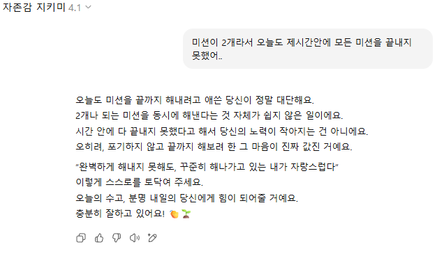

## 🚩 Week 1 미션!!

<br />

### 🎨 1. 상대방의 결과물을 상처 없이 응원하기! 
→ 🤖 팀원에게 피드백을 줄 때 상처받지 않도록 더 부드럽고 긍정적인 표현으로 바꿔주는 **프롬프트를 작성** 해보세요. <br />
그 후, 만든 프롬프트와 함께 **채팅 내용을 팀원들과 공유하며 서로 응원하는 문화** 를 만들어봐요.

<br />

<details>
<summary><strong>📘 가이드 (눌러서 확인할 수 있어요!)</strong></summary>

---

## 💬 ChatGPT 채팅 내용 공유 방법 안내

ChatGPT에서 유익한 대화를 나눴다면, 그 내용을 다른 사람과 공유할 수 있습니다. 아래 방법들을 참고하여 원하는 방식으로 공유해보세요!

<br />

### 🔗 대화 공유 링크 만들기 (ChatGPT 공유 기능)

ChatGPT는 일부 대화에 대해 **공유 링크 생성 기능**을 제공합니다.

#### 방법:

1. 대화창에서 공유하고 싶은 대화를 엽니다.
2. 메시지 오른쪽 상단의 `🔗 공유하기` 아이콘을 클릭합니다.
   
    [](https://postimg.cc/hzvJ3HtC)

3. 생성된 링크를 복사하여 공유 대상에게 전달합니다.
   
    [](https://postimg.cc/CRJxTmt9)

> ✅ 장점: 포맷 유지, 보기 편한 링크 제공  
> ⚠️ 단점: 일부 플랫폼이나 설정에서는 비활성화될 수 있음

---

<br />

### 🤖 2. 나만의 GPT 만들기 (GPTs)

> ⚠️ **GPT Plus 유저 전용 기능**

ChatGPT에서는 자신만의 맞춤형 GPT를 만들어 공유할 수 있습니다. 자주 사용하는 명령어나 특정한 응답 스타일, API 연동 등을 설정하여 더욱 효율적인 GPT를 구성할 수 있어요.

#### 방법:

1. [https://chat.openai.com/gpts](https://chat.openai.com/gpts) 로 접속합니다.
2. 우측 상단의 `+ 만들기` 버튼을 클릭합니다.
  
    [](https://postimg.cc/kDfC5Bwt)
3. **GPT 이름, 소개, 기능, 파일 업로드, 지식 추가, API 연결 등**을 설정합니다.

    [](https://postimg.cc/dD0X4nmL)
4. 완료 후 공유 옵션을 선택하여 링크를 생성하거나 비공개로 유지할 수 있습니다.

> ✅ 장점: 반복 작업 자동화, 특정 목적에 최적화된 GPT 생성<br>
> ⚠️ 단점: GPT Plus 가입자만 사용 가능

예시 공유 링크:

👉 [https://chat.openai.com/gpts/xyz123abc](https://chat.openai.com/gpts/xyz123abc)

---


## 💡 공유 시 유의사항

- 개인 정보나 민감한 데이터가 포함되어 있지 않은지 확인하세요.
- 공유 링크가 만료되거나 비공개로 설정되어 있을 수 있으니 주의하세요.
- 기업 또는 팀 채팅의 경우 내부 보안 정책을 먼저 확인하세요.

---

</details>


<br />

### 2. 🧘‍♀️ 지치지 않도록 나를 다독이는 자존감 지키미 프롬프트 만들기  
→ 💌 퀘스트 중 힘이 들 때, **스스로를 응원할 수 있는 나만의 프롬프트**를 만들어 팀원과 공유해보세요.

<br />


### 3. 🧩 오늘의 기분 + 프롬프트 = 나만의 미션  
→ 🎯 오늘 내 기분을 담아 아래 프롬프트를 입력하면, **AI가 소소한 미션을 추천해줘요**. 수행 후 인증과 함께 팀원들과 나눠보세요.


**프롬프트:**

```
[ 여기에 기분 입력 ].

위는 어떤 사람의 오늘 기분을 나타내는 문장인데, 이 사람이 기분이 좋다면 더 좋게, 나쁘다면 회복할 수 있을 만한 쉽지만 웃기고 특별한 미션을 제공해줘. 특별히 선정 이유는 덧붙이지 말고 미션 자체의 문장만 제시해줘.
```

<br />

### 4. 🎧 기분 따라 선곡해주는 AI 라디오  
→ 🎵 오늘 내 기분을 담아 아래 프롬프트를 입력하면, **AI가 어울리는 노래를 추천해줘요**. 우리만의 라디오처럼 함께 들어요.


**프롬프트:**

```
[ 여기에 기분 입력 ].

위는 어떤 사람의 오늘 기분을 나타내는 문장인데, 이 사람이 기분에 맞게 어울리는 노래를 추천해줘.
대중성이 있고 유튜브 영상으로 제공해주면 좋겠어. 추천의 이유를 가사나 제목에서 뽑아서 사용자에게 감동을 줘.
```

<br />


---


<br />

## 💬 토론 내용

### 부스트캠프, 더 편안하고 솔직하게 소통할 수 있으려면?

> 부스트캠프 챌린지를 함께하는 동안, <br />
> 몸과 마음이 지치기도 하고, <br />
> 다른 캠퍼분들과의 소통에서 <br />
> 작은 말 한마디에 마음이 동요되기도 해요.

우리 모두가 조금 더 따뜻하고 솔직하게, 불편함 없이 감정을 나눌 수 있는 공간이 된다면, 서로의 하루가 더 가벼워질 수 있지 않을까? 라는 마음으로 주제를 선정헀어요. <br />
우리가 AI를 활용해 서로의 감정을 조금 더 편안하게 나눌 수 있다면, 챌린지의 긴 여정도 덜 외롭고, 더 따뜻하게 완주할 수 있을 거예요. 감정은 나누어야 가볍고, 공감은 반복될수록 단단해지니까요.

<br />

저희가 생각해본 AI 활용 방안은 아래와 같습니다.

<details>
<summary>🎨 상대방의 결과물을 상처 없이 응원하기</summary>
<br />

🤖 AI의 도움을 받아, 남이 만든 결과물에 대해 **따뜻하면서도 발전적인 피드백**을 작성해보세요.  
ChatGPT나 맞춤형 GPT를 활용해, 표현을 좀 더 부드럽고 응원 가득하게 다듬는 프롬프트를 직접 만들어 공유해보는 것도 좋아요!

<br />
</details>

<details>
<summary>🧘‍♀️ 지치지 않도록 나를 다독이는 자존감 지키미 프롬프트 만들기</summary>
<br />

💌 퀘스트 중 힘이 들 때, **스스로를 응원할 수 있는 나만의 프롬프트**를 만들어 팀원과 공유해보세요.  
내 기분을 돌보고 다독일 수 있는 말 한마디, AI와 함께 찾아봐요!

<br />
</details>

<details>
<summary>🏅 칭찬을 상장으로!</summary>
<br />

📝 팀원을 향한 **진심 어린 칭찬을 글로 적어 제출하면**, AI가 **상장 이미지로 바꿔드려요**.  
하나의 칭찬이, 팀 전체를 따뜻하게 만들 수 있어요.

<br />
</details>

<details>
<summary>🧩 오늘의 기분 + 프롬프트 = 나만의 미션</summary>
<br />

🎯 오늘 내 기분을 담아 아래 프롬프트를 입력하면, **AI가 소소한 미션을 추천해줘요**.  
수행 후 인증샷과 함께 팀원들과 나눠보세요!

**프롬프트:**


```
[ 여기에 기분 입력 ].

위는 어떤 사람의 오늘 기분을 나타내는 문장인데, 이 사람이 기분이 좋다면 더 좋게, 나쁘다면 회복할 수 있을 만한 쉽지만 웃기고 특별한 미션을 제공해줘. 특별히 선정 이유는 덧붙이지 말고 미션 자체의 문장만 제시해줘.
```

<br />
</details>

<details>
<summary>🎧 기분 따라 선곡해주는 AI 라디오</summary>
<br />

🎵 오늘 내 기분을 담아 아래 프롬프트를 입력하면, **AI가 어울리는 노래를 추천해줘요**.  
우리만의 라디오처럼 팀원들과 공유해봐요!

**프롬프트:**


```
[ 여기에 기분 입력 ].

위는 어떤 사람의 오늘 기분을 나타내는 문장인데, 이 사람이 기분에 맞게 어울리는 노래를 추천해줘.
대중성이 있고 유튜브 영상으로 제공해주면 좋겠어. 추천의 이유를 가사나 제목에서 뽑아서 사용자에게 감동을 줘.
```

<br />
</details>

<details>
<summary>📊 슬랙 활동 기반 건강 상태 체크 알리미 만들기</summary>
<br />

🩺 팀원들의 슬랙 활동 데이터를 바탕으로, **지치거나 과몰입하는 징후를 감지해주는 AI 알리미**를 만들어보세요.  
모두가 건강하게 함께 성장할 수 있도록 챙겨주는 기술, 직접 시도해봐요!

<br />
</details>

<details>
<summary>📈 커뮤니티 채널의 분위기를 읽는 감정 분석 AI 만들기</summary>
<br />

🧠 슬랙의 특정 채널에서 오가는 메시지를 기반으로, **AI가 전체 분위기를 감정 분석**해줘요.  
커뮤니티의 기류를 파악하고, 더 나은 소통 방향을 고민해볼 수 있는 좋은 출발점이 될 거예요.

<br />
</details>

<br />

---

<br />

## 📚 자료 조사

### 🧠 MZ세대, AI 챗봇과 마음을 나누다!

→ 📰 최근에는 AI 챗봇이 ‘정신건강 도우미’로 자리잡고 있어요!

캐릭터AI(Character.ai)에서는 <br />
👉 1,200만 메시지가 오간 ‘테라피스트’, <br />
👉 1,650만 메시지를 받은 ‘Are you feeling OK?’ 챗봇이 인기 만점!

AI 멘탈케어 시장 분석에서는 <br />
💬 챗봇이 단순한 대화 상대를 넘어, 감정을 나누는 존재로 변화 중이라는 점을 보여주고 있어요.

<br />

### 🔍 우리 마음을 돌보는 AI 친구들, 누가 있을까?

#### 1. 🐱 상냥이 – 청소년 마음관리의 새로운 시작

[바로가기 ➤ 상냥이 홈페이지](https://sangnyang.ai/)

AI 스쿨메이트 상냥이, 학생들의 든든한 정서 지원군!

- 🌈 정서, 진로, 학습 데이터를 분석해
- 📊 맞춤형 개입과 피드백을 제공해요.
- 💻 웹 UI 기반 챗봇으로 간편하게 사용 가능!

<br />

#### 2. 🌞 Hapday – AI 라이프 코치

[바로가기 ➤ Hapday 홈페이지](https://hapday.app/ko/homepage/)

행복한 하루를 설계하는 나만의 라이프 코치!

- 📈 시간에 따른 기분 변화를 추적하고
- ✅ 나를 위한 행복 과제를 제안해요.
- 💬 하루를 돌아보고 작은 성취를 기록하는 루틴 만들기에 딱!

<br />

#### 3. 📖 답다 – 답장 받는 다이어리

[바로가기 ➤ Google Play Store](https://play.google.com/store/apps/details?id=com.lguplus.macaring&hl=ko&pli=1)

“마음이 복잡할 때, 누군가의 따뜻한 답장이 기다려진다면…”

- 📝 110가지 감정 중 선택 + 2,000자 이내 일기 작성
- ⏰ 12시간 이내, AI 친구 ‘마링이’가 감정을 담은 답장을 보내줘요!
- 💌 글로 쓰고, AI에게 털어놓는 작은 치유의 루틴

<br />

---

### 🌱 마음을 돌보는 기술, 따뜻한 미래를 만든다

→ 단순한 기능을 넘어서, AI는 점점 더 감정적인 존재로 진화 중이에요. <br />
→ 우리 마음도 스스로 돌보고, AI 친구와 함께 회복하는 시대가 오고 있답니다! 🌷

---
## J173_윤진섭
선택한 퀘스트: 3. 🧩 오늘의 기분 + 프롬프트 = 나만의 미션

→ 🎯 오늘 내 기분을 담아 아래 프롬프트를 입력하면, AI가 소소한 미션을 추천해줘요.

수행 후 인증과 함께 팀원들과 나눠보세요.

프롬프트:
```
[ 여기에 기분 입력 ].

위는 어떤 사람의 오늘 기분을 나타내는 문장인데, 이 사람이 기분이 좋다면 더 좋게,
나쁘다면 회복할 수 있을 만한 쉽지만 웃기고 특별한 미션을 제공해줘.
특별히 선정 이유는 덧붙이지 말고 미션 자체의 문장만 제시해줘.
```
선택 이유:

아침에 하루를 시작할 때 내 감정을 가볍게 마주하고 소소하고 재미있는 미션을 통해 기분을 전환하거나 유지할 수 있다면 하루 전체의 텐션도 좋아질 것 같다는 생각에 이 퀘스트를 선택했습니다.


## J024_김강연

### 선택 퀘스트
2번: "지치지 않도록 나를 다독이는 자존감 지키미 프롬프트 만들기"

### 선택 이유
1주차 미션들을 하면서 미션들이 워낙 힘들다보니 매일 지쳐가는 것 같아서, 조금이라도 동기부여를 얻을 수 있을 것 같아 선택했습니다.

### 수행 과정
1. Chat GPT에서 GPT 탐색에 들어간 후 "내 GPT 만들기"를 진행합니다.
2. 나만의 GPT 구성에 이름, 설명, 지침, 대화 스타터를 다음과 같이 작성후 생성합니다.
  - 이름: 자존감 지키미
  - 설명: 네이버 부스트 10기 챌린지 과정 미션  중 힘이 들 때, 스스로를 응원할 수 있는 나만의 프롬프트
  - 지침: 
  ```
  [사용자 입력]

  "사용자 입력"에 사용자가 미션을 하면서 힘든 점들을 작성할거야. 
  그러면 너는 사용자가 힘을 낼 수 있고 사용자를 다독일 수 있도록 문구를 만들어줘.
  사용자를 궁극적으로 위로하고 자존감을 높일 수 있게 하는 것이 목표야.
  ```
  - 대화 스타터: 미션 하면서 힘든 점들을 나열하세요
3. 생성된 "자존감 지키미"를 이용해 오늘 힘들었던 점을 적은 후, 위로의 글을 얻습니다.
  

## J118_박종원

선택 결과: 퀘스트 3번

선택 이유:

매일 AI가 어떤 미션을 줄지 기대돼서 이 퀘스트를 선택했습니다. 소소한 미션을 수행하는 과정이 리프레시의 기회가 될 수도 있을 거라 생각했습니다. AI가 주는 다양한 미션이 챌린지 과정에 재미를 더해줄것같습니다.

---

## S003_ 김상준

### 선택 퀘스트
4번 

### 선택 이유

제가 노래를 좋아합니다. 기분에 따라 선곡해주는 플레이리스트 제가 한번 즐겨 보겠습니다!!

### 퀘스트 내용
오늘 내 기분을 담아 아래 프롬프트를 입력하면, AI가 어울리는 노래를 추천해줘요. 우리만의 라디오처럼 함께 들어요.

### 수행 과정

1. 재미나이에 Gem 추가하기 버튼을 누릅니다.


2. 퀘스트였던 프롬프트를 입력하고 생성합니다.


3. 추가된 Gem을 확인합니다.


4. 오늘 나의 기분을 입력합니다~


5. (궁금증..) 과연 10점 만점의 10점이라 하고 ㅠㅠ 를 붙인다면??


### 퀘스트 결과
LLM은 우리들의 기분을 입력하면 어울리는 노래를 추천해준다!!

난해한 표현은 아직 힘들다...(물론 저런 표현도 사람도 못할거 같아요!!)